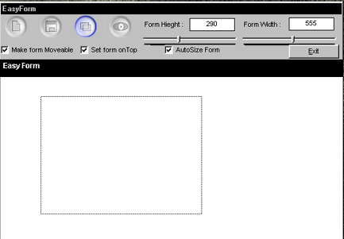



## Easy Form Editor

### Description

Hey people it's me agian. ;-)

This littel program make it easy for you too make a shaped form.

You just draw(with the mouse) on the form and click save, then the program saved the shape and

writes a *.frm file for you to use in VB. It all so exports the picture you drawn so you can make it fansy in photoshop or something like that, and then use it as your bagground in your form.

- TIPS -

Now i made the sample bagground in photoshop, and i know you dont need to know how, but if i tell you. Then you can't say i did't tell you everthing! *hehe*

To make the bagground .

New picture (400 * 400 pixels)

click FILTER -> RENDER -> Driffernt Clouds

click FILTER -> NOISE -> NOISE (1%)

click NEW CLANNEL

click FILTER -> RENDER -> Driffernt Clouds

click FILTER -> NOISE -> NOISE (1%)

click FILTER -> RENDER -> Driffernt Clouds

click FILTER -> RENDER -> Lighting Effect

Light type = spotligt

Gloss = 59

Materiale = 69

exposure = -100

ambience = 47

texture channel = alfa1

height = 100

Now please give me a vote... just a small one(or bigger)..

Yours

CiX

Remember its all about haveing fun ;-)
 
### More Info
 
I only testet this on Windows 98.

I know the form you generate will work on any system, but there can be some problems with my program on winnt(Or so i think)..

             |
---                |---
**Submitted On**   |2001-03-08 20:08:20
**By**             |[CiX](https://github.com/Planet-Source-Code/PSCIndex/blob/master/ByAuthor/cix.md)
**Level**          |Intermediate
**User Rating**    |3.9 (31 globes from 8 users)
**Compatibility**  |VB 6\.0
**Category**       |[Custom Controls/ Forms/  Menus](https://github.com/Planet-Source-Code/PSCIndex/blob/master/ByCategory/custom-controls-forms-menus__1-4.md)
**World**          |[Visual Basic](https://github.com/Planet-Source-Code/PSCIndex/blob/master/ByWorld/visual-basic.md)
**Archive File**   |[CODE\_UPLOAD171273162001\.zip](https://github.com/Planet-Source-Code/cix-easy-form-editor__1-21679/archive/master.zip)

### API Declarations

Uhmm just a few....

